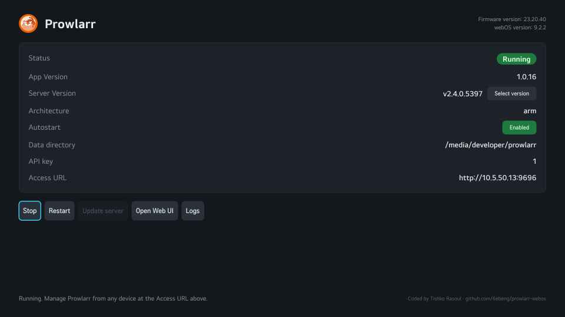

# Jackett for webOS

Run [Jackett](https://github.com/Jackett/Jackett) on your LG TV. A webOS homebrew app (`.ipk`) with a small launcher UI plus a background service that downloads, runs and supervises the official Jackett build. Manage it from any device at `http://<tv-ip>:9117`.

> Works on both **rooted** (Homebrew Channel) and **non-rooted** (Developer Mode only) webOS TVs, from **webOS 4.x through 9.x** (tested on 4.10.0 and 9.2.2). Boot **autostart** requires a rooted TV — on non-rooted TVs the Autostart button is disabled and you launch the app manually after a reboot. API key defaults to `1`.



## Build

```powershell
npm run build
```

## Deploy

```powershell
npm run deploy                                                          # build + install + elevate
powershell -ExecutionPolicy Bypass -File scripts/deploy.ps1 -Autostart  # also enable boot autostart
```

## Usage

1. Launch **Jackett** on the TV and press **Start** (first launch downloads ~95 MB).
2. Manage from any device at `http://<tv-ip>:9117`.

Buttons: Start / Stop / Restart / Update / Select version / Autostart / Open Web UI / Logs.

**Select version** installs any official Jackett release (upgrade or downgrade). The downloaded archive is deleted right after extraction to save space.

## Updating

- **Homebrew Channel** (recommended): keeps root elevation automatically — Autostart stays available with no extra steps.
- **webOS Dev Manager / sideload**: overwriting the `.ipk` resets the service to a non-root (jailed) launcher, so Autostart temporarily shows as unavailable. While elevated the app installs a persistent boot hook (outside the app folder, so it survives updates) that restores elevation — **reboot the TV once** after the update and Autostart works again.

## Notes

- Jackett binds all interfaces — set an admin account in Settings and keep it on a trusted LAN.
- The background service is on-demand: it runs while the app is open and exits shortly after you close it. Jackett itself keeps running independently (started detached), so the server and any download continue in the background.
- Data is stored beside the app on the same partition it was installed to: `/media/cryptofs/Jackett` for Content Store installs, `/media/developer/Jackett` for Homebrew/Developer installs (falling back to `/home/root/Jackett`, `/media/internal/.Jackett`, `/tmp/Jackett` if needed).

## Layout

```
appinfo/   TV web app (tile + UI)
service/   node service + jackett-run.sh supervisor
scripts/   build / deploy (PowerShell)
```

## Credits

[Jackett](https://github.com/Jackett/Jackett) (GPL-3.0, fetched at runtime). Wrapper: MIT. Coded by **Tishko Rasoul** — [github.com/6ebeng/jackett-webos](https://github.com/6ebeng/jackett-webos)
